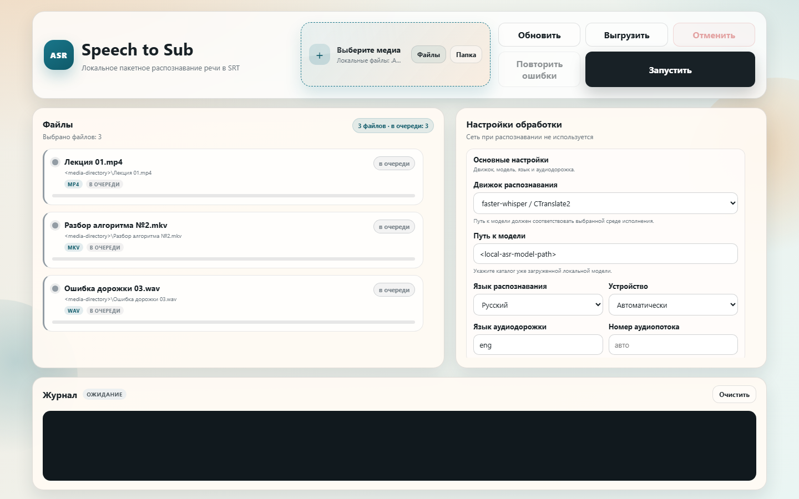

# speech-to-sub-recognition

Приложение для пакетного извлечения аудио из видео, автоматического распознавания речи (ASR)
и создания субтитров SRT. Основной режим работает локально на машине пользователя. Если
выбранной локальной модели ещё нет в заданном каталоге, приложение может докачать её перед
первым реальным распознаванием. Отдельный явно разрешаемый режим использует OpenAI API.

```text
видео или аудио -> ffprobe -> FFmpeg, FLAC mono 16 кГц
                -> локальная модель или явно разрешённый OpenAI API
                -> необязательное выравнивание -> проверенный SRT
```

Текущее состояние и датированные результаты проверок находятся в [STATUS.md](STATUS.md),
история значимых изменений — в [CHANGELOG.md](CHANGELOG.md), требования — в
[PRD.md](PRD.md).

## Возможности

- одиночная и пакетная обработка видео- и аудиофайлов;
- запуск из командной строки и через локальный веб-интерфейс;
- автоматический рекурсивный сбор поддерживаемых медиа из каталога, выбранного в
  веб-интерфейсе;
- инвентаризация аудиопотоков через `ffprobe` и явный выбор дорожки;
- подготовка монофонического FLAC 16 кГц через FFmpeg;
- локальные движки `faster-whisper`, `transformers`, `parakeet-tdt-v3` и `qwen3-asr`;
- докачивание отсутствующей или неполной локальной модели в заданный каталог после проверки
  свободного места;
- необязательное облачное распознавание `whisper-1` через OpenAI API с отдельным согласием на
  каждый запуск;
- необязательный модуль `qwen3-forced-aligner` для словного выравнивания;
- русский, английский и автоматическое определение языка в поддерживающих его движках;
- последовательная обработка длинных записей без единого массива несжатого аудио всего файла
  в основном профиле `faster-whisper`;
- разметка SRT по готовым предложениям со смысловой балансировкой строк и диагностикой
  фактической скорости чтения;
- диагностический сопроводительный JSON, проверяемый кеш и полное повторное распознавание по
  явному флагу перезаписи;
- атомарная публикация результатов и межпроцессная блокировка;
- сохраняемая в SQLite очередь веб-задач, восстановление после перезапуска, отмена и повтор
  только неуспешных файлов;
- поток событий сервера (SSE) с продолжением после последнего принятого события;
- русский ход выбора и подготовки в браузере и ограниченном ротационном файловом журнале;
- рабочая область веб-интерфейса, которая занимает доступную высоту окна и сохраняет независимую
  прокрутку списков и настроек.

## Архитектура

Командный и веб-интерфейсы используют общий слой обработки. Конкретные движки распознавания
и выравнивания подключаются через реестры, поэтому правила выбора аудиопотока, кеширования,
формирования SRT и публикации файлов не дублируются.

```text
.
├─ speech_to_sub
│  ├─ __init__.py                  # версия пакета
│  ├─ __main__.py                  # запуск python -m speech_to_sub
│  ├─ benchmark.py                 # метрики SRT, памяти и видеопамяти
│  ├─ cli.py                       # командная строка и коды завершения
│  ├─ constants.py                 # расширения и значения по умолчанию
│  ├─ exceptions.py                # доменные исключения
│  ├─ models.py                    # настройки, потоки, сегменты и результаты
│  ├─ service.py                   # общий пакетный конвейер
│  ├─ asr
│  │  ├─ base.py                   # контракт движка распознавания
│  │  ├─ checkpoints.py            # проверка локальных моделей
│  │  ├─ external_worker.py        # клиент протокола изолированных процессов
│  │  ├─ faster_whisper.py         # основной движок CTranslate2
│  │  ├─ openai_api.py             # явно разрешаемое облачное распознавание
│  │  ├─ parakeet_tdt.py           # адаптер Parakeet TDT v3
│  │  ├─ qwen3.py                  # адаптер Qwen3-ASR
│  │  ├─ registry.py               # реестр и выгрузка движков
│  │  └─ transformers_whisper.py   # запасной Whisper через Transformers
│  ├─ alignment
│  │  ├─ base.py                   # общий контракт выравнивания
│  │  ├─ qwen_forced.py            # Qwen3 ForcedAligner и безопасный возврат
│  │  └─ registry.py               # реестр модулей выравнивания
│  ├─ workers
│  │  ├─ common.py                 # общий кадровый протокол NDJSON
│  │  ├─ parakeet_worker.py        # изолированный процесс Parakeet
│  │  ├─ qwen_worker.py            # изолированный процесс Qwen3-ASR
│  │  └─ qwen_aligner_worker.py    # изолированный процесс выравнивания Qwen
│  ├─ media
│  │  ├─ audio_windows.py          # оконное декодирование длинного аудио
│  │  └─ ffmpeg.py                 # ffprobe, выбор потока и нормализация
│  ├─ subtitles
│  │  ├─ builder.py                # слова и сегменты -> реплики -> SRT
│  │  ├─ layout.py                 # согласование текста и временных меток
│  │  └─ validator.py              # синтаксическая и временная проверка
│  ├─ utils
│  │  ├─ cache.py                  # контрольный отпечаток и сопроводительный JSON
│  │  ├─ env_utils.py              # чтение настроек окружения
│  │  ├─ huggingface.py            # проверка и докачивание локальных моделей
│  │  ├─ io_utils.py               # UTF-8 без BOM и атомарная запись
│  │  ├─ logging_utils.py          # журналирование
│  │  └─ model_utils.py            # GPU, CPU, квантование и выгрузка
│  └─ web
│     ├─ __main__.py               # запуск Uvicorn
│     ├─ app.py                    # маршруты FastAPI и локальная защита
│     ├─ job_store.py              # сохраняемое SQLite-хранилище
│     ├─ jobs.py                   # очередь, восстановление, отмена, повтор и SSE
│     ├─ picker.py                 # системные диалоги выбора файлов
│     ├─ preparation.py            # состояние выбора и подготовки карточек
│     ├─ schemas.py                # модели и проверка запросов API
│     └─ static
│        ├─ index.html             # страница пакетной обработки
│        ├─ app.js                 # состояние интерфейса и поток событий
│        └─ styles.css             # оформление интерфейса
├─ .codex
│  └─ skills/fix-sonar             # проектный цикл анализа SonarQube
├─ docs
│  ├─ benchmarks                   # методики и первичные результаты измерений
│  └─ *.md, *.pdf                  # исходные исследовательские материалы
├─ requirements-workers
│  ├─ parakeet.txt                 # зависимости процесса Parakeet
│  └─ qwen.txt                     # зависимости процессов Qwen
├─ resources
│  ├─ cache                        # служебный кеш
│  ├─ models                       # локальные модели по умолчанию
│  ├─ runtimes                     # локальные изолированные окружения
│  ├─ state                        # SQLite веб-задач
│  └─ work                         # временные файлы и рабочие артефакты
├─ tests                           # модульные, интеграционные и браузерные проверки
├─ tools
│  └─ benchmark_asr.py             # воспроизводимый запуск сравнительных измерений
├─ .env                            # локальные настройки, не публикуются
├─ .env.example                    # переносимый образец настроек
├─ CHANGELOG.md                    # история значимых изменений
├─ CHECKLIST.md                    # незавершённые пункты текущей цели
├─ PRD.md                          # подробные требования и критерии приёмки
├─ README.md                       # установка, настройка и использование
├─ SONAR.md                        # порядок анализа SonarQube
├─ STATUS.md                       # датированные проверки и известные риски
├─ package.json                    # браузерные проверки
├─ playwright.config.mjs           # конфигурация Playwright
├─ pyproject.toml                  # пакет, pytest и покрытие
├─ requirements.txt                # закреплённые зависимости основного окружения
├─ run_web.ps1                     # запуск локального веб-интерфейса
├─ setup_workers.ps1               # создание изолированных окружений
└─ sonar-project.properties.example # переносимый образец SonarQube
```

Дополнительные сведения:

- [CHECKLIST.md](CHECKLIST.md) — ход активной цели;
- [docs/benchmarks/v1.2](docs/benchmarks/v1.2/README.md) — методика измерений длинных записей;
- [docs/benchmarks/v1.4](docs/benchmarks/v1.4/README.md) — сравнение локальных движков;
- [SONAR.md](SONAR.md) — переносимый порядок проверки SonarQube;
- [docs](docs) — исходные исследования и дополнительные материалы.

## Локальные модели

Если путь не задан явно, командный и веб-интерфейсы используют каталог соответствующей модели
в `<repo-root>/resources/models`. Модель можно хранить в другом месте, задав `ASR_MODEL_PATH`
или аргумент `--model-path`. Выбранный путь при докачивании не заменяется другим: файлы попадают
непосредственно в указанный каталог.

Полная модель проходит локальную проверку без обращения к Hugging Face Hub. Сеть используется
только после промаха кеша распознавания, когда модель отсутствует или неполна и включено
`ASR_AUTO_DOWNLOAD_MODEL`. Перед загрузкой приложение получает сведения о файлах, проверяет
свободное место, устанавливает межпроцессную блокировку и продолжает уже начатую загрузку без
повторного скачивания готовых файлов. Проверка работоспособности, восстановление страницы и
полностью готовый кеш к сети не обращаются.

Автоматическую загрузку можно отключить через `ASR_AUTO_DOWNLOAD_MODEL=0` либо параметром
`--no-auto-download-model`. В этом случае неполная модель приводит к понятной ошибке. Необязательный
`HF_TOKEN` читается только из окружения и нужен лишь для репозитория, требующего авторизации;
он не передаётся через веб-запросы и не сохраняется в результатах.

| Значение `ASR_BACKEND` | Локальная модель | Среда выполнения | Назначение |
|---|---|---|---|
| `faster-whisper` | `<local-faster-whisper-model-path>` | основной Python, CTranslate2 | рекомендуемый профиль для длинных записей и русской речи |
| `transformers` | `<local-transformers-model-path>` | основной Python, PyTorch | запасной профиль совместимости |
| `parakeet-tdt-v3` | `<local-parakeet-model-path>` | изолированный Python 3.14 | дополнительный локальный движок |
| `qwen3-asr` | `<local-qwen-asr-model-path>` | изолированный Python 3.11 | дополнительный локальный движок |

Для `ASR_ALIGNER=qwen3-forced-aligner` также нужен каталог
`<local-qwen-aligner-model-path>`. Распознавание и выравнивание Qwen выполняются в отдельных
последовательно загружаемых процессах. Для `faster-whisper` дополнительное выравнивание обычно
не требуется, поскольку он уже возвращает словные временные метки.

Parakeet и Qwen нельзя устанавливать в основное виртуальное окружение: их закреплённые наборы
зависимостей находятся в `requirements-workers/parakeet.txt` и
`requirements-workers/qwen.txt`. Подготовка выполняется только явной командой владельца.
Parakeet использует PyTorch и Transformers из основной среды. Если она находится не в штатной
`.venv` внутри `<repo-root>`, задайте `SPEECH_TO_SUB_MAIN_SITE_PACKAGES` как путь к её каталогу
`site-packages`.

## Облачное распознавание

Движок `openai-api` использует только модель `whisper-1`, потому что она возвращает сегментные
и словные временные метки, необходимые общему сборщику SRT. Локальный режим остаётся основным.

Облачный запуск выполняется только при одновременном выполнении трёх условий:

- выбран `ASR_BACKEND=openai-api`;
- ключ находится в локальной переменной `OPENAI_API_KEY`;
- пользователь явно включил `ASR_ALLOW_CLOUD_PROCESSING=1`, передал
  `--allow-cloud-processing` или подтвердил отправку в веб-интерфейсе.

Веб-интерфейс не сохраняет согласие между запусками. Ключ не принимается через командные
аргументы или веб-API, не возвращается в конфигурации интерфейса и не записывается в журнал,
кеш или сопроводительный JSON.

[Файловый интерфейс OpenAI](https://developers.openai.com/api/docs/guides/speech-to-text)
принимает файл размером до 25 МБ. Приложение готовит последовательные MP3-фрагменты длительностью
до 15 минут и размером не более 24 000 000 байт, использует двухсекундное перекрытие, переносит
временные метки относительно начала записи и удаляет граничные дубли.

## Входные данные

Поддерживаемые видео: `.mp4`, `.m4v`, `.mov`, `.mkv`, `.webm`.

Поддерживаемое аудио: `.wav`, `.flac`, `.mp3`, `.m4a`, `.aac`, `.ogg`, `.opus`, `.mka`.

Пути с пробелами и символами Unicode поддерживаются. Для контейнера с несколькими
аудиопотоками можно указать нулевой порядковый номер. Без явного номера приложение сначала
ищет единственную дорожку с языком из `ASR_AUDIO_LANGUAGE`, затем использует единственный
доступный поток. Неоднозначность сопровождается предупреждением.

Исходные медиафайлы не изменяются и не удаляются.

Кнопка «Папка» в веб-интерфейсе всегда собирает поддерживаемые медиа рекурсивно, включая все
уровни вложенных каталогов. Созданные приложением `*.asr.flac`, символические ссылки и
соединения каталогов Windows (`junction`) в такой список не попадают. В командной строке
рекурсивный обход каталога остаётся явным и включается параметром `--recursive`.

Пустой, исчезнувший после выбора или недоступный для получения атрибутов файл получает
собственную ошибку без несуществующих выходных путей. Остальные пути смешанного пакета
продолжают проверку и обработку.

## Выходные данные

Для `<media-directory>\lecture.mp4` и языка `en` по умолчанию создаются:

```text
<media-directory>\lecture.en.srt
<media-directory>\lecture.en.asr.json
```

- `.srt` — проверенные субтитры в UTF-8 без BOM;
- `.asr.json` — контрольный отпечаток источника, выбранный поток, движок и параметры,
  временные сегменты, время начала и окончания обработки, фактические максимумы скорости,
  длительности и длины строк, число превышений ориентиров, диагностика сдвигов внутренних
  границ SRT и число узких нормализаций растянутых якорей `timing_anomaly_adjustments`;
- `.asr.flac` — необязательный нормализованный звук при `ASR_KEEP_AUDIO=1`.

SRT, сопроводительный JSON и сохраняемый FLAC сначала готовятся во временных соседних файлах.
Готовый набор публикуется атомарно; при частичном сбое восстанавливается предыдущая согласованная
версия. Пустой или не прошедший проверку SRT не становится готовым результатом.

Если разные входы дают один целевой путь, к имени добавляется расширение источника, а при
повторной коллизии — короткая контрольная сумма абсолютного пути.

## Правила формирования SRT

Текст, регистр и пунктуация берутся из `segment.text`, а словные метки используются как
временные якоря. Диагностический результат распознавания в сопроводительном JSON при разметке
не изменяется.

Разметка следует фиксированной последовательности: словные якоря → предложения → смысловые
строки → отдельное назначение времени. До сборки предложений узко нормализуются только
аномально растянутые якоря; текст, порядок слов и исходный `Transcript` при этом не меняются.
Смысловые строки и соседние реплики выбираются глобально по готовому тексту, а их временные
границы назначаются уже после этого отдельным этапом. Скорость речи и пауза сама по себе не
управляют текстовым разбиением. Предложение закрывает только завершающая пунктуация; внутри
него слова можно перераспределять между строками и репликами независимо от пауз.

Разметчик:

- объединяет продолжение фразы через технические границы сегментов распознавания и паузы;
- начинает новое предложение с новой строки либо новой реплики;
- перераспределяет слова между соседними репликами всего предложения, чтобы не оставлять
  однословные начала и хвосты при наличии лучшей раскладки;
- предпочитает строки не длиннее 42 символов Unicode, но при необходимости сохранить цельную
  фразу или устранить неудачный короткий остаток допускает до 8 дополнительных символов;
- сохраняет неделимый длинный токен целиком, даже если он неизбежно превышает целевую ширину,
  и отмечает такой случай в диагностике вместо остановки обработки;
- допускает не более двух строк в реплике;
- использует 17 отображаемых символов в секунду и диапазон 0,8–7,0 секунды как ориентиры
  читаемости, но подстраивает показ под фактическую речь и никогда не отклоняет из-за них
  непустой результат распознавания;
- сохраняет положительные непересекающиеся интервалы и после округления допускает выход за
  длительность аудио не более чем на неизбежную часть миллисекундного кванта;
- для искусственного аудио короче одной миллисекунды использует минимальный положительный
  интервал SRT продолжительностью одну миллисекунду;
- сохраняет в диагностике число превышений ориентиров, фактические максимумы, число сдвигов
  временных границ и наибольшую величину сдвига;
- сохраняет число узких нормализаций растянутых словных якорей в поле
  `timing_anomaly_adjustments`;
- различает отдельное русское тире и внутрисловный дефис;
- консервативно обрабатывает короткую начальную аномальную временную метку перед большой паузой.

Базовая длина 42 символа, две строки и ориентир 17 символов в секунду следуют
[руководству Netflix для русских субтитров](https://partnerhelp.netflixstudios.com/hc/en-us/articles/215346638-Russian-Timed-Text-Style-Guide).
Эти значения используются как цель раскладки и как диагностическая граница, а не как условие
успеха. Реальная быстрая речь, длинная пауза внутри фразы или неделимый токен не должны
превращать готовый текст в ошибку задачи.

## Кеш и безопасность данных

Сопроводительный JSON хранит два независимых отпечатка. `recognition_settings`
описывает тяжёлое распознавание и выравнивание, а `layout_settings` — лёгкую SRT-разметку.
Полностью готовый кеш требует совпадения обоих отпечатков и валидного SRT.

- совпавшие валидные результаты получают состояние `cached` без загрузки модели;
- при совпадении `recognition_settings` отсутствующий SRT пересобирается из сохранённого
  `Transcript` без FFmpeg и повторного запуска модели;
- существующий SRT без подтверждающего JSON не перезаписывается и получает состояние `skipped`;
- существующий SRT при несовпавшей разметке также не заменяется без `--force`;
- `--force` обходит кеш готового SRT и сохранённого распознавания, повторно выполняет
  нормализацию аудио, движок распознавания и выбранное выравнивание, после чего атомарно
  заменяет вычисленные целевые SRT, JSON и сохраняемый FLAC;
- в веб-интерфейсе разрешение перезаписи одноразовое: оно не сохраняется в браузере и
  сбрасывается сразу после формирования запроса задачи;
- изменение источника, аудиопотока, модели, среды, параметров распознавания или выравнивания
  запрещает переиспользование `Transcript`;
- повреждённый `Transcript` в JSON не принимается: сервис выполняет обычное распознавание;
- при `--force` выключенном сопроводительный JSON прежнего совместимого формата переиспользует
  сохранённый `Transcript` только после проверки тяжёлого отпечатка; неизвестные и
  несовместимые форматы отклоняются;
- одна активная задача не допускает дублирования тяжёлой модели в видеопамяти;
- очистка служебных каталогов не затрагивает пользовательские исходники;
- веб-сервис принимает только фактические локальные подключения и локальный заголовок `Host`;
  изменяющие состояние запросы дополнительно проверяют точный `Origin`;
- удалённый и многопользовательский режимы без аутентификации отсутствуют.

## Настройки окружения

Полный переносимый образец находится в [.env.example](.env.example). Перед запуском его
копируют в локальный `.env` и заменяют плейсхолдеры реальными путями. `.env` не публикуется.

### Распознавание и модели

| Переменная | Значение по умолчанию или назначение |
|---|---|
| `ASR_BACKEND` | `faster-whisper` |
| `ASR_MODEL_PATH` | локальный путь к выбранной модели; по умолчанию каталог соответствующей модели в `<repo-root>/resources/models` |
| `ASR_AUTO_DOWNLOAD_MODEL` | `1`; докачать отсутствующую или неполную локальную модель при реальном промахе кеша |
| `ASR_ALIGNER` | `none` или `qwen3-forced-aligner` |
| `ASR_ALIGNER_MODEL_PATH` | локальный путь к модели выравнивания; по умолчанию соответствующий каталог в `<repo-root>/resources/models` |
| `ASR_WORKER_PYTHON` | необязательный Python процесса выбранного движка |
| `ASR_ALIGNER_WORKER_PYTHON` | независимый Python процесса выравнивания |
| `QWEN_ASR_PYTHON` | среда Qwen по умолчанию |
| `PARAKEET_ASR_PYTHON` | среда Parakeet по умолчанию |
| `SPEECH_TO_SUB_MAIN_SITE_PACKAGES` | необязательный путь к `site-packages` основной среды для Parakeet |
| `ASR_LANGUAGE` | `en`, `ru` или `auto`; по умолчанию `en` |
| `ASR_AUDIO_LANGUAGE` | предпочитаемый язык дорожки; по умолчанию `eng` |
| `ASR_AUDIO_STREAM_INDEX` | необязательный нулевой порядковый номер аудиопотока |
| `ASR_DEVICE` | `auto`, `cuda` или `cpu` |
| `ASR_QUANTIZATION` | включение поддерживаемой 8-битной конфигурации |
| `ASR_ALLOW_CPU_FALLBACK` | явное разрешение запасного запуска на процессоре |
| `HF_TOKEN` | необязательный токен Hugging Face только в локальном окружении |
| `ASR_ALLOW_CLOUD_PROCESSING` | `0`; явное разрешение отправки аудио во внешний сервис |
| `OPENAI_TRANSCRIPTION_MODEL` | единственное допустимое значение `whisper-1` |
| `OPENAI_API_KEY` | секретный ключ только в локальном окружении; в репозитории остаётся пустым |

### Разметка, длинные записи и вывод

| Переменная | Значение по умолчанию или назначение |
|---|---|
| `ASR_MAX_CHARS_PER_LINE` | предпочтительная базовая длина строки, 42 символа |
| `ASR_LINE_LENGTH_GAP` | адаптивный допуск от 0 до 20 символов, по умолчанию 8; `0` отключает допуск |
| `ASR_MAX_CPS` | диагностический ориентир скорости чтения, по умолчанию 17 символов в секунду |
| `ASR_LONG_FORM_WINDOW_SECONDS` | окно `faster-whisper`, 300 секунд |
| `ASR_LONG_FORM_OVERLAP_SECONDS` | перекрытие окон, 2 секунды |
| `ASR_VAD_FILTER` | фильтрация тишины включена |
| `ASR_VAD_MIN_SILENCE_MS` | минимальная тишина, 600 мс |
| `ASR_BEAM_SIZE` | ширина поиска, 5 |
| `ASR_CONDITION_ON_PREVIOUS_TEXT` | учитывать предыдущий текст |
| `ASR_KEEP_AUDIO` | сохранять нормализованный FLAC |
| `ASR_OUTPUT_DIR` | необязательный каталог результатов |
| `FFMPEG_PATH`, `FFPROBE_PATH` | команды из `PATH` либо явные локальные пути |
| `HF_HOME`, `HUGGINGFACE_HUB_CACHE` | необязательные локальные кеши Hugging Face |

### Веб-интерфейс и проверки

| Переменная | Значение по умолчанию или назначение |
|---|---|
| `WEB_HOST` | `127.0.0.1`; внешний адрес отклоняется |
| `WEB_PORT` | `7862` |
| `WEB_JOB_DB` | `resources\state\jobs.sqlite3` |
| `RUN_LOCAL_ASR_TEST`, `ASR_TEST_MEDIA`, `ASR_TEST_LANGUAGE` | явная одиночная проверка реальной модели |
| `RUN_BATCH_ASR_TEST`, `ASR_BATCH_TEST_MEDIA` | явная проверка реального пакета |
| `RUN_MULTITRACK_ASR_TEST`, `ASR_MULTITRACK_MEDIA` | явная проверка контейнера с несколькими дорожками |
| `ASR_MULTITRACK_RU_STREAM_INDEX`, `ASR_MULTITRACK_EN_STREAM_INDEX` | номера дорожек такой проверки |
| `SONAR_HOST_URL`, `SONAR_TOKEN` | локальный SonarQube; токен хранится только вне репозитория |

Параметры длинных записей входят в тяжёлый отпечаток, а параметры разметки — в лёгкий. Если SRT
отсутствует, совпавшее распознавание может быть использовано для его пересборки без `--force`.
Включённый `--force` всегда требует нового распознавания и не читает кеши результатов.

## Интерфейсы

### Командная строка

Один файл или каталог передаётся через `--input`. Доступны рекурсивный обход, явный движок,
модель, язык, аудиопоток, устройство, модуль выравнивания, ограничения SRT, управление
докачиванием модели, явное разрешение облачной обработки, полное повторное распознавание и
подробный журнал.

`--max-chars-per-line` задаёт предпочтительную базовую длину строки, а `--line-length-gap` —
допустимое адаптивное превышение. По умолчанию используются значения 42 и 8, поэтому обычная
целевая верхняя граница равна 50 символам. Неделимый длинный токен сохраняется целиком, а
превышение записывается в диагностику. Коды завершения:

- `0` — все файлы готовы, взяты из кеша или безопасно пропущены;
- `1` — ошибка конфигурации или входных данных до запуска пакета;
- `2` — пакет завершён, но один или несколько файлов имеют состояние `error`.

### Веб-интерфейс



Кнопки выбора файлов и каталогов открывают системный диалог на той же машине. Большие медиа
не копируются через браузер и не читаются целиком в его память. Карточка файла показывает
длительность медиа, аудиопотоки, выбранную дорожку, текущую стадию, ход выполнения, результат
и ошибку. Во время обработки свежая длительность появляется сразу после рабочего `ffprobe` и
сохраняется после завершения, ошибки, отмены и перезагрузки страницы; до успешной проверки
неизвестное значение не подменяется нулём.

Кнопка «Папка» всегда обходит выбранный каталог рекурсивно. Сразу после начала выбора журнал
браузера показывает открытие диалога, обход, число найденных файлов и ход проверки потоков.
Предварительная подготовка не вычисляет полный SHA-256 медиа; до четырёх процессов `ffprobe`
работают параллельно, но карточки сохраняют детерминированный порядок. Ошибка отдельного файла
остаётся в его карточке и не скрывает остальные результаты.

За один выбор или запуск принимается до 10 000 файлов. Все они остаются в подборке и
обрабатываются, но страница одновременно показывает не более 200 карточек и предоставляет
переходы между страницами. Обновление отдельного файла выполняется через индекс по пути, а
сводка меняется инкрементально, поэтому событие не требует перебора и повторной отрисовки всех
10 000 элементов.

Изменение настройки сохраняет новое значение, но не запускает скрытую повторную проверку всей
подборки. Для этого предназначена явная кнопка «Обновить»; новый выбор и запуск задачи также
актуализируют нужные данные. Потеря связи с сервером и необработанная ошибка JavaScript
показываются в журнале браузера, поэтому длительная операция не завершается молча.

Ход подготовки связан с конкретным запросом по поколению и `operation_id`; его счётчики не
уменьшаются. Если распознавание уже занято, отклонённый с ответом `409` запуск не подменяет ход
активной операции.

SQLite сохраняет состояние задачи и файлов. После перезапуска незавершённая задача получает
явное состояние `interrupted`; пользователь может повторить только неуспешные элементы.
Успешные результаты повторно не запускаются. Поток SSE продолжается по курсору без повторной
доставки уже принятых событий.

На настольном экране список файлов и настройки занимают оставшуюся высоту окна, но не становятся
ниже рабочего минимума. Каждая область прокручивается независимо, а журнал остаётся ниже рабочей
области. На узком экране блоки переходят в естественный вертикальный поток. При выборе
`openai-api` локальные параметры модели скрываются, появляется предупреждение об отправке аудио,
а согласие требуется заново перед каждой задачей. Флаг перезаписи также не восстанавливается из
локального хранилища или снимка задачи и требует нового включения для каждого запуска и повтора.

## Ограничения

- облачный режим поддерживает только `whisper-1`; другие модели и потоковое распознавание не
  реализованы;
- диаризация и идентификация говорящих не реализованы;
- редактор субтитров и встраивание SRT обратно в контейнер не реализованы;
- после перезапуска тяжёлое распознавание не продолжается с середины файла;
- `transformers` может держать полный массив несжатого аудио и не рекомендуется для длинных
  записей;
- изолированные процессы Parakeet и Qwen требуют заранее подготовленных сред; их модели могут
  быть размещены заранее или докачаны при первом реальном распознавании;
- Qwen3 ForcedAligner требует явно определённый язык `en` или `ru`;
- без размеченных эталонов проект не заявляет значения WER, CER и абсолютной ошибки временных
  меток;
- веб-интерфейс не предназначен для удалённого или многопользовательского доступа.

## Локальная установка, запуск и проверка

### Windows PowerShell

Требования:

- Windows и PowerShell;
- Python 3.14 x64;
- FFmpeg и `ffprobe` в `PATH` либо их явные пути;
- достаточно свободного места для выбранной локальной модели либо уже готовая модель;
- совместимая NVIDIA GPU и CUDA для штатного режима на видеокарте;
- Python 3.11 x64 только для Qwen;
- Node.js только для браузерных проверок.

Проверка основных внешних команд:

```powershell
ffmpeg -version
ffprobe -version
py -3.14 --version
```

Создание основного окружения:

```powershell
Set-Location -LiteralPath "<repo-root>"
py -3.14 -m venv .venv
.\.venv\Scripts\python.exe -m pip install --upgrade pip
.\.venv\Scripts\python.exe -m pip install -r requirements.txt
Copy-Item -LiteralPath .env.example -Destination .env
```

В `.env` замените `<local-asr-model-path>` собственным каталогом либо очистите значение, чтобы
использовать каталог выбранного движка внутри `<repo-root>/resources/models`. Если модель там ещё
неполна, штатная настройка докачает её при первом реальном распознавании. Для выбранного профиля
также задаются пути к изолированному Python, модели выравнивания и локальному кешу, если они
используются. Секретные `HF_TOKEN` и `OPENAI_API_KEY` задаются только в локальном `.env` или
окружении процесса и не публикуются.

Подготовка обоих изолированных окружений:

```powershell
.\setup_workers.ps1
```

Только Parakeet или только Qwen:

```powershell
.\setup_workers.ps1 -Parakeet
.\setup_workers.ps1 -Qwen
```

Распознавание одного файла основным профилем:

```powershell
.\.venv\Scripts\python.exe -m speech_to_sub `
  --input "<media-file>" `
  --backend faster-whisper `
  --model-path "<local-faster-whisper-model-path>" `
  --language auto
```

Чтобы потребовать полностью автономный запуск и запретить докачивание:

```powershell
.\.venv\Scripts\python.exe -m speech_to_sub `
  --input "<media-file>" `
  --backend faster-whisper `
  --model-path "<local-faster-whisper-model-path>" `
  --no-auto-download-model
```

Рекурсивная обработка каталога:

```powershell
.\.venv\Scripts\python.exe -m speech_to_sub `
  --input "<media-directory>" `
  --recursive `
  --language ru
```

Qwen3-ASR с выравниванием:

```powershell
.\.venv\Scripts\python.exe -m speech_to_sub `
  --input "<media-file>" `
  --backend qwen3-asr `
  --model-path "<local-qwen-asr-model-path>" `
  --aligner qwen3-forced-aligner `
  --aligner-model-path "<local-qwen-aligner-model-path>" `
  --worker-python-path "resources\runtimes\qwen\Scripts\python.exe" `
  --aligner-worker-python-path "resources\runtimes\qwen\Scripts\python.exe" `
  --language en
```

Облачное распознавание после размещения ключа в локальном окружении:

```powershell
.\.venv\Scripts\python.exe -m speech_to_sub `
  --input "<media-file>" `
  --backend openai-api `
  --allow-cloud-processing `
  --language auto
```

Запуск веб-интерфейса:

```powershell
.\run_web.ps1
```

После запуска откройте `http://127.0.0.1:7862`. Равнозначный запуск через модуль:

```powershell
.\.venv\Scripts\python.exe -m speech_to_sub.web
```

Текущая веб-сессия, сообщения приложения и задач, а также журналы доступа и ошибок Uvicorn
записываются в `logs\speech_to_sub-web.log` в UTF-8 без BOM. Файлом владеет один обработчик
Python: импорт модулей не открывает его, а сценарий запуска не конкурирует с сервером за
ротацию. В журнал попадают PID процесса, начало и остановка сессии, ход задач и трассировки
ошибок. При достижении 5 МиБ хранятся три архива
`speech_to_sub-web.log.1`–`speech_to_sub-web.log.3`. Журнал командного интерфейса
`logs\speech_to_sub.log` этим сценарием не изменяется.

Основные проверки без загрузки реальной модели:

```powershell
.\.venv\Scripts\python.exe -B -m pytest
.\.venv\Scripts\python.exe -m ruff check .
.\.venv\Scripts\python.exe -m pip check
node --check speech_to_sub\web\static\app.js
npm ci
npm test
```

Тяжёлая проверка включается только явно и пишет результаты во временный каталог тестов:

```powershell
$env:RUN_LOCAL_ASR_TEST = "1"
$env:ASR_TEST_MEDIA = "<media-file>"
$env:ASR_TEST_LANGUAGE = "en"
.\.venv\Scripts\python.exe -B -m pytest -m integration
```

Для SonarQube скопируйте безопасный шаблон, задайте локальные значения только в окружении и
запустите проектный сценарий:

```powershell
Copy-Item -LiteralPath sonar-project.properties.example -Destination sonar-project.properties
$env:SONAR_HOST_URL = "<sonar-url>"
$env:SONAR_TOKEN = "<sonar-token>"
powershell -NoProfile -ExecutionPolicy Bypass -File `
  .codex\skills\fix-sonar\scripts\sonar_cycle.ps1 -RequireClean
```

Токен, рабочий `sonar-project.properties`, `.env`, отчёты покрытия и локальные окружения не
добавляются в репозиторий. Подробности приведены в [SONAR.md](SONAR.md).

### Linux, macOS и WSL

Эти окружения не входят в подтверждённый сценарий проекта. Команды PowerShell, пути
`resources\runtimes\...` и закреплённые наборы зависимостей для изолированных процессов нельзя
считать переносимыми на другие ОС без отдельной проверки. Для добавления поддержки требуется
отдельно подтвердить установку FFmpeg, CUDA или процессорного режима, создание окружений моделей,
запуск интерфейсов и полный набор тестов.
