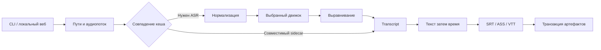

# Архитектура

1. CLI и веб вызывают общий сервис, а форматирование отделено от ASR.
2. Единый Transcript связывает движки, выравнивание и формирователи.
3. Кеш проверяется до загрузки весов; выбранный локальный путь не заменяется скрытым.
4. Тяжёлые несовместимые среды изолированы; Qwen ASR и aligner идут последовательно.
5. Публикация одного формата сохраняет согласованный набор и не затрагивает другие форматы.

| Область           | Спецификация                                                    | Компонент реализации                                                                                                                       |
|-------------------|-----------------------------------------------------------------|--------------------------------------------------------------------------------------------------------------------------------------------|
| Ввод и подготовка | [media-preparation](../specs/media-preparation/spec.md)         | [service.py](../../speech_to_sub/service.py), [ffmpeg.py](../../speech_to_sub/media/ffmpeg.py)                                             |
| Движки и модели   | [speech-recognition](../specs/speech-recognition/spec.md)       | [registry.py](../../speech_to_sub/asr/registry.py), [huggingface.py](../../speech_to_sub/utils/huggingface.py)                             |
| Раскладка         | [subtitle-layout](../specs/subtitle-layout/spec.md)             | [builder.py](../../speech_to_sub/subtitles/builder.py), [formats.py](../../speech_to_sub/subtitles/formats.py)                             |
| Результаты        | [recognition-artifacts](../specs/recognition-artifacts/spec.md) | [service.py](../../speech_to_sub/service.py), [cache.py](../../speech_to_sub/utils/cache.py)                                               |
| Веб-задачи        | [local-web-workflow](../specs/local-web-workflow/spec.md)       | [app.py](../../speech_to_sub/web/app.py), [jobs.py](../../speech_to_sub/web/jobs.py), [job_store.py](../../speech_to_sub/web/job_store.py) |

Причины выбора и альтернативы — в [ADR](ADR/README.md); проверяемые связи — в [examples](examples/README.md).
